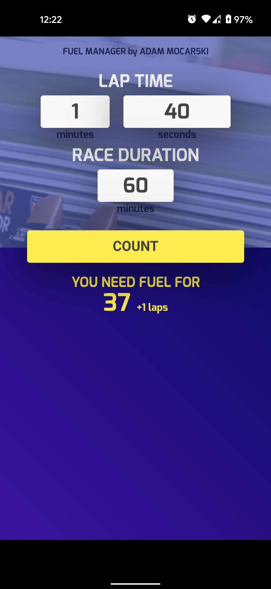

# FuelManager
**No more, "how many laps" "liters?" etc. yelling before race.** :checkered_flag: :red_car:

App that helps count in fast and easy way how 
much fuel the simracing driver need depends 
on approximate lap time. 

(domain has expired)
Web version: http://fuelmanager.tk

# Downloads
All Android app releases available here: https://github.com/amocarski/FuelManager/releases

